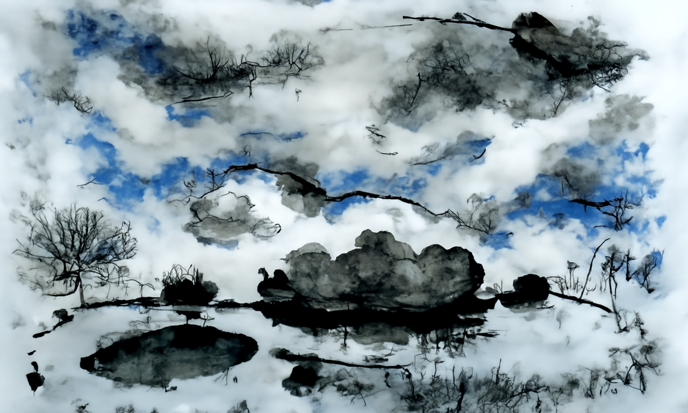
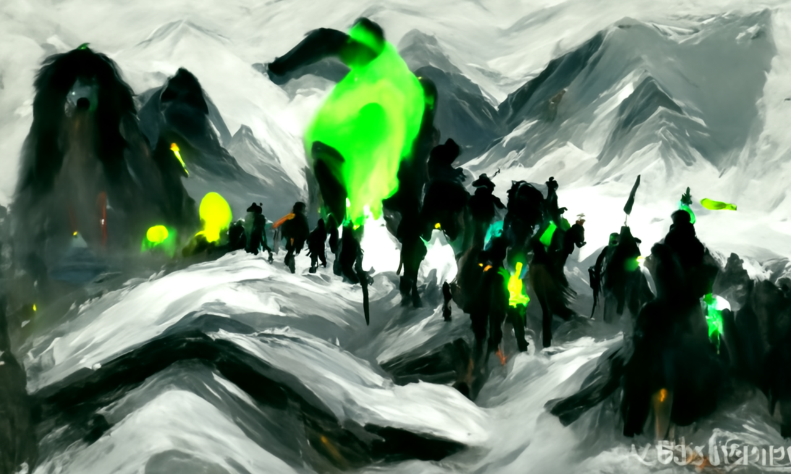
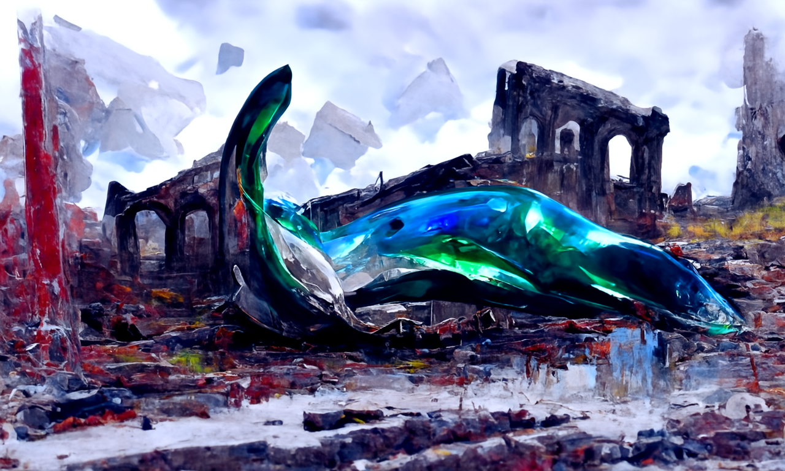
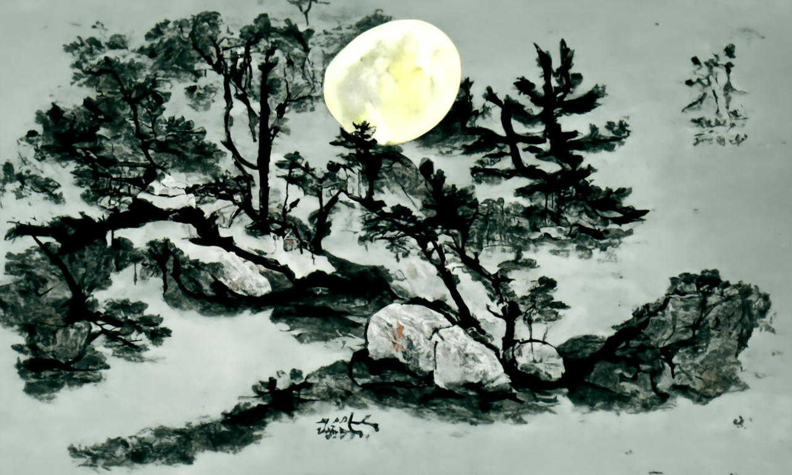
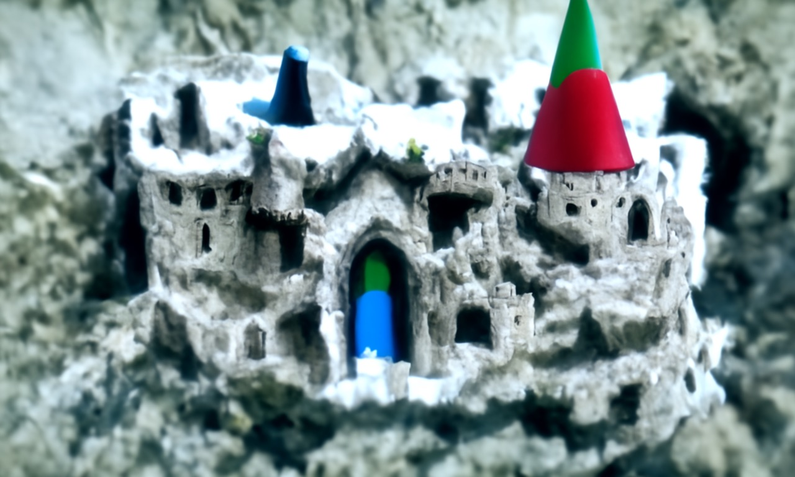
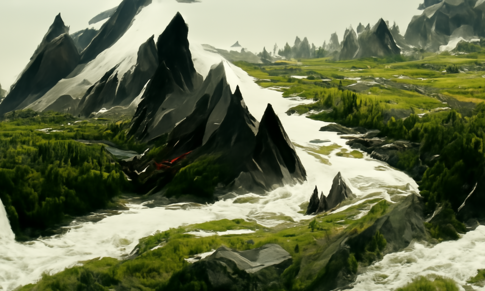

# disco-diffusion-wrapper
My implementation of [disco diffusion](https://github.com/alembics/disco-diffusion) wrapper that could run your own GPU with a batch  of input text. 


## What this repo did
1.Separate the model loading and model inference parts of the initial code. Now you can use it like:
```python
# init and load pretrain model.
disco = DiscoDiffusion()
# infer
disco.draw(text, ...)
```

2.Use [deepL](https://www.deepl.com/translator) to preprocess the text, so that you can use any language you like to draw.
The default language pair is from `Chinese`->`English`(`ZH`->`EN-US`)，you can change it in `run.py` or `run_batch.py`
```python
def translate(text, source_lang="ZH", target_lang="EN-US"):
    res = translator.translate_text(text, source_lang="ZH", target_lang="EN-US")
    return res
```

3.Batch generating & saving.
As the loading part and the inferring part is seperated, you do not need to load pretrain model again for a new sentence. This reduces a bunch of time.
```python
cd disco-diffusion-wrapper/wrapper
# create and fill the sentence.list
python run_batch.py
```
The output images is saved by the name of the  origin text, so you can easily find it even after a deepL.


## Usage
```bash
git clone git@github.com:mazzzystar/disco-diffusion-wrapper.git
cd disco-diffusion-wrapper

# download pretrain model checkpoints
# If this step is slow, you can download these model mannually from urls in the 
# code of wrapper/utils.py, then put these checkpoints in the corresponding folder.
python wrapper/utils.py

cd wrapper

# generated image by one sentence
python run.py "一行白鹭上青天"

# batch generation
touch sentence.list
# fill your text in, one by a line.
python batch_run.py
```

## Samples
Below are some samples generated using this repo. 

> 半亩方塘一鉴开，天光云影共徘徊，水墨画


> 雪山，平原，幽鬼军队在夜里打着荧光绿色的火把前行，抽象画，Trending on artstation


>躺在废墟中的玻璃鲸鱼，抽象画



> 明月松间照，清泉石上流，中国画


> Elf Castle


> 山随平野尽，江入大荒流，Trending on artstation

You can download all our Chinese poem generating results from [here](https://drive.google.com/file/d/1OIsupQqMaYYWu4B0eemUWgvPfTSGyaqf/view?usp=sharing).

If you use this project and produced some interesting results, submissions are welcomed.


## Problems
As it's for fun, I did not look much into the details, and deleted many features(such as VR/3D/Video ...) to make me faster and more clear on the project resonctruction. It's awesome if you're interested in restoring the original function, PR is wellcomed.


